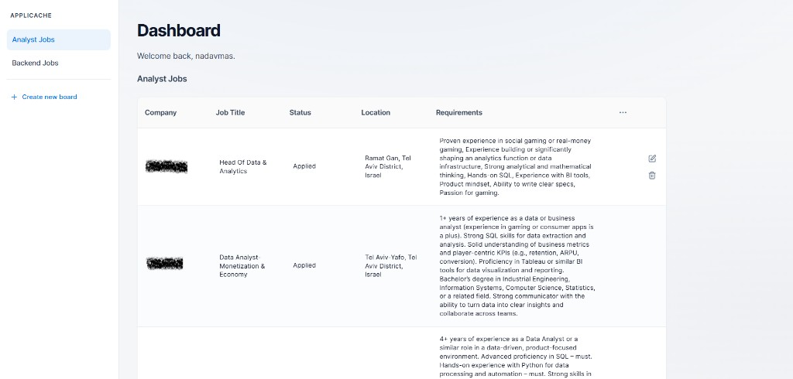
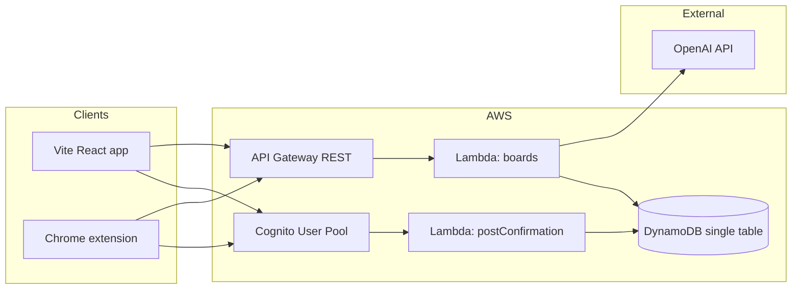

# AppliCache

**AppliCache** is a full-stack portfolio project: a job-application tracker with a **React** web app, **serverless AWS** backend, and a **Chrome extension** that captures roles from LinkedIn. It is designed to demonstrate how I think about product, architecture, and shipping working software—not a spreadsheet with extra steps, but authenticated APIs, real persistence, and a cohesive user journey from browser to cloud.

## App View
---
<p align="center">
  
</p>
<p align="center">
  
</p>
<table style="width:100%">
  <tr>
    <td style="width:50%; text-align:center;">
      <br>
      <em>Chrome Extension - LinkedIn Integration</em>
    </td>
    <td style="width:50%; text-align:center;">
      <br>
      <em>AI Smart Cache - Mapping Page Data</em>
    </td>
  </tr>
</table>

---

## Why this project

Job seekers often default to spreadsheets. They work, but they are fragile: no single sign-on, no structured API, and no path from “I saw this on LinkedIn” to “it’s saved in my system.” AppliCache explores that gap with a **multi-surface** design (web + extension), **per-user data isolation**, and room to grow (reminders, analytics, collaboration).

---

## What’s implemented today

| Area | Details |
|------|---------|
| **Web app** | Vite + React 19 + Router: landing, auth pages, dashboard calling REST APIs. |
| **Auth & data** | Cognito (Amplify v6); post-confirmation Lambda → DynamoDB profile. Boards with columns/rows (single-table PK/SK), Node 20 Lambdas. |
| **API** | API Gateway REST + Cognito JWT authorizer; board/entry CRUD. |
| **AI & extension** | Smart Cache: OpenAI maps page text to your columns. MV3 extension (LinkedIn) + token sync from the web app; `npm run sync-extension-env` aligns API URL. |

---

## Architecture



- **Infrastructure as code**: `backend/template.yaml` (**AWS SAM**) defines Cognito, DynamoDB, API Gateway, and Lambdas so the stack is reviewable and repeatable.
- **Security posture**: API routes expect `Authorization: Bearer <id token>`; data access is keyed by authenticated **subject** (`sub`) in the backend.

---

## Tech stack

| Layer | Choices |
|-------|---------|
| Frontend | React 19, Vite 8, React Router 7, AWS Amplify Auth |
| Backend | AWS Lambda (Node.js 20), API Gateway REST, DynamoDB, Cognito |
| Extension | Manifest V3, Chrome scripting & messaging APIs |
| AI | OpenAI (smart-cache path; API key supplied at deploy time) |
| IaC | AWS SAM (`template.yaml`) |

---

## Repository layout

```
frontend/          # Web app (npm package: build, dev, preview)
backend/           # SAM template + Lambda functions
  functions/
    boards/        # Board CRUD, entries, smart-cache
    postConfirmation/
extension/         # Chrome extension (popup, content, background)
scripts/           # e.g. sync-extension-env — align extension API URL with Vite env
docs/screenshots/  # Images used in README
```

---

## Local development (overview)

1. **Prerequisites**: Node.js (LTS), AWS SAM CLI, an AWS account for deploys, and (for smart-cache) an OpenAI API key if you use that route.

2. **Frontend env**: Copy `frontend/.env.example` to `frontend/.env.local` and set:
   - `VITE_COGNITO_USER_POOL_ID`, `VITE_COGNITO_USER_POOL_CLIENT_ID` (from your Cognito app client)
   - `VITE_API_URL` — REST API base URL **including** stage path, **no trailing slash** (see SAM output `RestApiUrl`)

3. **Run the app**: From the repo root, `npm run dev` runs the Vite dev server (see root `package.json`).

4. **Extension + API URL**: `npm run sync-extension-env` (when configured) keeps the extension’s API base in sync with `frontend/.env.local`.

5. **Deploy / update backend**: Use SAM from `backend/` (`sam build`, `sam deploy`) per your workflow; pass parameters such as `OpenAIApiKey` for smart-cache.

**Production hosting**: The frontend is a static Vite build (`npm run build` → `dist/`). You can host it on **S3 + CloudFront**, **Amplify Hosting**, **Vercel**, or similar—configure **CORS** on API Gateway for your real web origin (the template currently targets local dev for `AllowOrigin`; update for production).

---

*AppliCache — Cache applications to Catch opportunities.*
