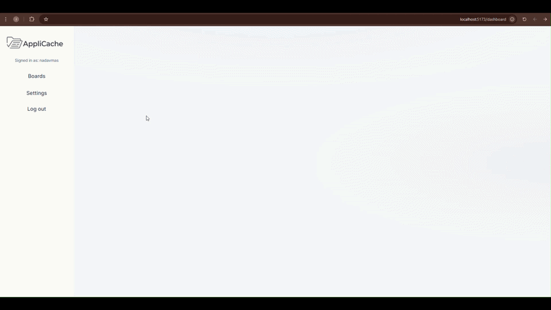
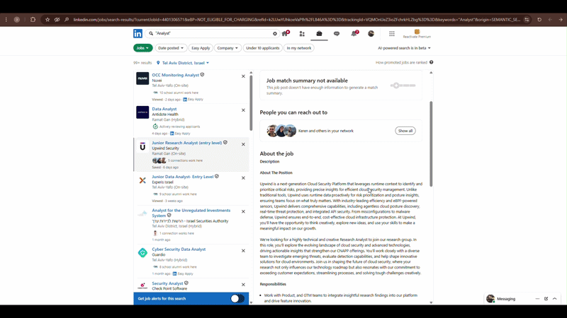
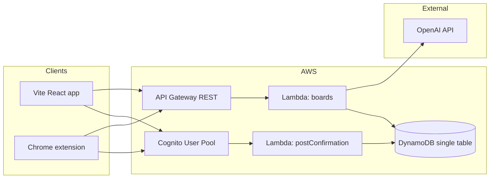

# AppliCache

**AppliCache** is a full-stack portfolio project: a job-application tracker with a **React** web app, **serverless AWS** backend, and a **Chrome extension** that captures roles from LinkedIn. It is designed to demonstrate how I think about product, architecture, and shipping working software—not a spreadsheet with extra steps, but authenticated APIs, real persistence, and a cohesive user journey from browser to cloud.

## App View

<details>
<summary><strong>Board Creation Flow</strong></summary>

<p align="center">
  
</p>

</details>

<details>
<summary><strong>AI-Powered Entry Tracking</strong></summary>

<p align="center">
  
</p>

</details>

---

## Why this project

Job seekers often default to spreadsheets. They work, but they are fragile: no single sign-on, no structured API, and no path from “I saw this on LinkedIn” to “it’s saved in my system.” AppliCache explores that gap with a **multi-surface** design (web + extension), **per-user data isolation**, and room to grow (reminders, analytics, collaboration).

---

## What’s implemented today

| Area | Details |
|------|---------|
| **Web app** | Vite + React 19 + Router: landing, auth pages, dashboard calling REST APIs. |
| **Auth & data** | Cognito (Amplify v6); post-confirmation Lambda → DynamoDB profile. Boards with columns/rows (single-table PK/SK), Node 20 Lambdas. |
| **API** | API Gateway REST + Cognito JWT authorizer; board/entry CRUD. |
| **AI & extension** | Smart Cache: OpenAI maps page text to your columns. MV3 extension (LinkedIn) + token sync from the web app; `npm run sync-extension-env` aligns API URL. |

---

## Architecture



- **Infrastructure as code**: `backend/template.yaml` (**AWS SAM**) defines Cognito, DynamoDB, API Gateway, and Lambdas so the stack is reviewable and repeatable.
- **Security posture**: API routes expect `Authorization: Bearer <id token>`; data access is keyed by authenticated **subject** (`sub`) in the backend.

---

## Tech stack

| Layer | Choices |
|-------|---------|
| Frontend | React 19, Vite 8, React Router 7, AWS Amplify Auth |
| Backend | AWS Lambda (Node.js 20), API Gateway REST, DynamoDB, Cognito |
| Extension | Manifest V3, Chrome scripting & messaging APIs |
| AI | OpenAI (smart-cache path; API key supplied at deploy time) |
| IaC | AWS SAM (`template.yaml`) |

---

## Repository layout

```
frontend/          # Web app (npm package: build, dev, preview)
backend/           # SAM template + Lambda functions
  functions/
    boards/        # Board CRUD, entries, smart-cache
    postConfirmation/
extension/         # Chrome extension (popup, content, background)
scripts/           # e.g. sync-extension-env — align extension API URL with Vite env
docs/screenshots/  # README media (demo GIFs)
```

---

## Running the web app and Chrome extension

You need a deployed (or locally emulated) backend and Cognito values before the app and extension can talk to the API. Set `frontend/.env.local` first, then follow the steps below.

### Web app (Vite dev server)

1. **Install dependencies** (once):

   ```bash
   npm --prefix frontend install
   ```

2. **Environment**: Copy `frontend/.env.example` to `frontend/.env.local` and fill in:

   - `VITE_AWS_REGION`
   - `VITE_COGNITO_USER_POOL_ID`, `VITE_COGNITO_USER_POOL_CLIENT_ID`
   - `VITE_API_URL` — REST API base URL **including** the stage path, **no trailing slash** (for example the `RestApiUrl` value from your SAM stack)

3. **Start the dev server** from the repository root:

   ```bash
   npm run dev
   ```

   This runs Vite’s dev server (default **http://localhost:5173**). Open that URL in Chrome, sign up or sign in, and use the dashboard as usual.

### Chrome extension (load unpacked)

The extension is plain MV3 assets under `extension/` (no separate build step). It reads the API base URL from a generated file so it stays aligned with the web app. For **local vs production** “open dashboard” / login tab URLs, edit **`extension/config.js`**: set **`IS_DEV`** to `true` for Vite on `http://localhost:5173`, or `false` for production; set **`APPLICACHE_PROD_APP_ORIGIN`** to your canonical SPA URL (no trailing slash), then reload the extension in `chrome://extensions`.

1. **Generate `extension/env.local.js`** after `frontend/.env.local` contains a valid `VITE_API_URL`:

   ```bash
   npm run sync-extension-env
   ```

   This writes `extension/env.local.js` (gitignored) with `APPLICACHE_API_BASE_URL` matching `VITE_API_URL`. Re-run this script whenever you change the API URL.

2. **Load the extension in Chrome**: open `chrome://extensions`, enable **Developer mode**, click **Load unpacked**, and choose the **`extension`** folder in this repo (the directory that contains `manifest.json`).

3. **Connect auth to the extension**: Sign in to AppliCache in the **same browser** at your SPA origin (e.g. **http://localhost:5173** or your **Vercel** URL). The SPA passes Cognito tokens to the extension; `extension/manifest.json` `externally_connectable` and `extension/config.js` `APPLICACHE_ALLOWED_ORIGINS` must include that origin. **`APPLICACHE_APP_ORIGIN`** is chosen from **`IS_DEV`** and **`APPLICACHE_PROD_APP_ORIGIN`** in `extension/config.js` (see paragraph above).

4. **Use it on LinkedIn**: Open a job page on **https://www.linkedin.com**, click the AppliCache toolbar icon, pick a board, and use **Cache this application** / **Save to Board**. If API calls fail, confirm `host_permissions` in `manifest.json` covers your API host (the template uses `*.execute-api.us-east-1.amazonaws.com`; adjust the region pattern if your API is elsewhere).

---

## Local development (overview)

1. **Prerequisites**: Node.js (LTS), AWS SAM CLI, an AWS account for deploys, and (for smart-cache) an OpenAI API key if you use that route.

2. **Frontend env**: Same variables as in [Web app](#web-app-vite-dev-server) — see `frontend/.env.example`.

3. **Run the app and extension**: Follow [Running the web app and Chrome extension](#running-the-web-app-and-chrome-extension) above.

4. **Deploy / update backend**: Use SAM from `backend/` (`sam build`, `sam deploy`) per your workflow; pass parameters such as `OpenAIApiKey` for smart-cache.

**Backend CORS (Vercel + localhost)**: [backend/template.yaml](backend/template.yaml) defines `AllowedCorsOrigins` (comma-separated list passed to the boards Lambda as `CORS_ALLOWED_ORIGINS`) and `CorsGatewayErrorOrigin` (single origin used only on API Gateway `DEFAULT_4XX` / `DEFAULT_5XX` responses when the Cognito authorizer rejects the request before Lambda runs). Override defaults at deploy time, e.g. `sam deploy --parameter-overrides CorsGatewayErrorOrigin=http://localhost:5173` if you need local-first behavior for those gateway errors. Successful API responses and `OPTIONS` preflight use the Lambda allowlist and the request `Origin` header.

**Optional Hosted UI**: Set `VITE_COGNITO_HOSTED_UI_DOMAIN` in the frontend env (see `frontend/.env.example`) only if you use Cognito Hosted UI; match callback/sign-out URLs in the Cognito app client.

**Production hosting**: The frontend is a static Vite build (`npm run build` → `dist/`). You can host it on **S3 + CloudFront**, **Amplify Hosting**, **Vercel**, or similar—ensure your deployed origin is listed in `AllowedCorsOrigins` and in the Chrome extension `manifest.json` / `extension/config.js` if you use the extension.

---

*AppliCache — Cache applications to Catch opportunities.*
